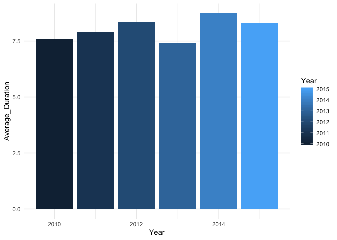
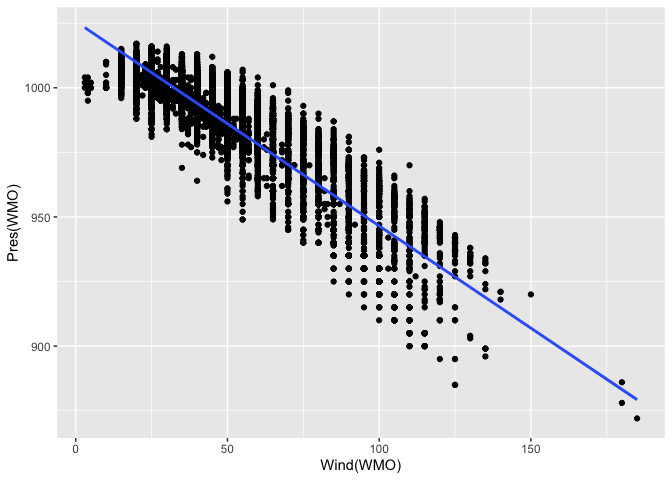
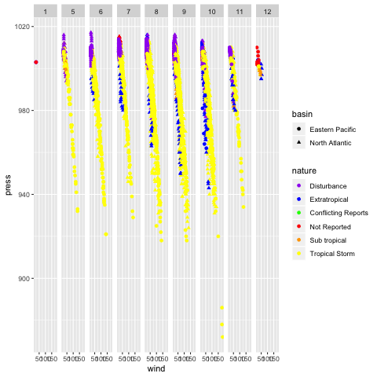
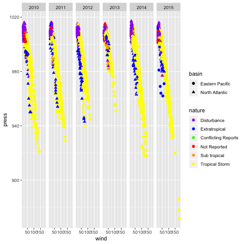
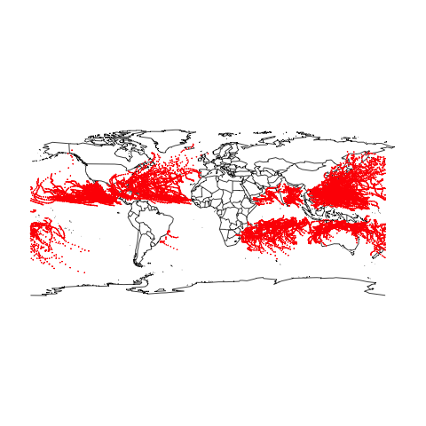
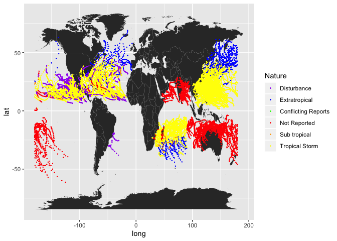
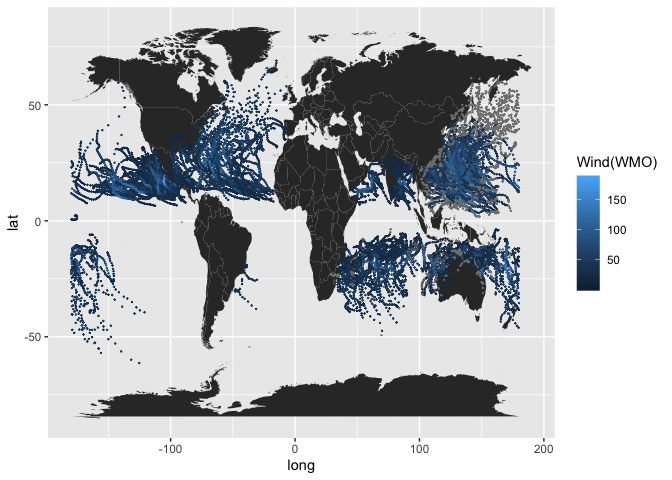
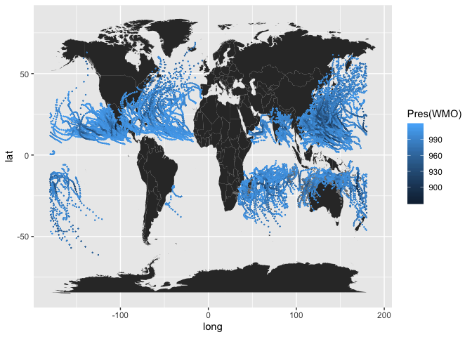

Workout 1 Report
================
John Schulz
10/20/2019

## Oceanic Storms from 2010 to 2015

**Synopsis**: By leveraging the International Best Track Archive for
Climate Stewardship (IBTrACS) data set, I have determined a number of
trends in oceanic storms across the globe. Over the years of 2010 to
2015, it is clear that there are many similarities and differences
between storms throughout the years. Through this report, I will support
my findings through a variety of graphs, maps and tables that were
generated with R code.

### The IBTraCS Data Set

The IBTraCS data set outlines many qualitative and quantitative
characteristics of oceanic storms including the season, basin, subbasin,
name, the wind and pressure, and many useful variables to analyze
storms. For the point of simplicity, we will only be using twelve of the
many variables that IBTraCS data set. Here is a random sample of our
data points to give you a better idea of what the IBTraCS raw data set
looks like.

<table>

<thead>

<tr>

<th style="text-align:left;">

Serial\_Num

</th>

<th style="text-align:right;">

Season

</th>

<th style="text-align:right;">

Num

</th>

<th style="text-align:left;">

Basin

</th>

<th style="text-align:left;">

Sub\_basin

</th>

<th style="text-align:left;">

Name

</th>

<th style="text-align:left;">

ISO\_time

</th>

<th style="text-align:left;">

Nature

</th>

<th style="text-align:right;">

Latitude

</th>

<th style="text-align:right;">

Longitude

</th>

<th style="text-align:right;">

Wind(WMO)

</th>

<th style="text-align:right;">

Pres(WMO)

</th>

</tr>

</thead>

<tbody>

<tr>

<td style="text-align:left;">

2014327S08077

</td>

<td style="text-align:right;">

2015

</td>

<td style="text-align:right;">

2

</td>

<td style="text-align:left;">

SI

</td>

<td style="text-align:left;">

MM

</td>

<td style="text-align:left;">

0220142015:TWO

</td>

<td style="text-align:left;">

11/25/14 18:00

</td>

<td style="text-align:left;">

TS

</td>

<td style="text-align:right;">

\-10.9

</td>

<td style="text-align:right;">

69.7

</td>

<td style="text-align:right;">

30

</td>

<td style="text-align:right;">

999

</td>

</tr>

<tr>

<td style="text-align:left;">

2014015S16043

</td>

<td style="text-align:right;">

2014

</td>

<td style="text-align:right;">

8

</td>

<td style="text-align:left;">

SI

</td>

<td style="text-align:left;">

MM

</td>

<td style="text-align:left;">

DELIWE

</td>

<td style="text-align:left;">

1/16/14 0:00

</td>

<td style="text-align:left;">

TS

</td>

<td style="text-align:right;">

\-18.6

</td>

<td style="text-align:right;">

44.1

</td>

<td style="text-align:right;">

20

</td>

<td style="text-align:right;">

1004

</td>

</tr>

<tr>

<td style="text-align:left;">

2013187N20156

</td>

<td style="text-align:right;">

2013

</td>

<td style="text-align:right;">

7

</td>

<td style="text-align:left;">

WP

</td>

<td style="text-align:left;">

MM

</td>

<td style="text-align:left;">

SOULIK

</td>

<td style="text-align:left;">

7/6/13 18:00

</td>

<td style="text-align:left;">

NR

</td>

<td style="text-align:right;">

NA

</td>

<td style="text-align:right;">

NA

</td>

<td style="text-align:right;">

NA

</td>

<td style="text-align:right;">

NA

</td>

</tr>

<tr>

<td style="text-align:left;">

2015274N17167

</td>

<td style="text-align:right;">

2015

</td>

<td style="text-align:right;">

23

</td>

<td style="text-align:left;">

WP

</td>

<td style="text-align:left;">

MM

</td>

<td style="text-align:left;">

CHOI-WAN

</td>

<td style="text-align:left;">

10/10/15 0:00

</td>

<td style="text-align:left;">

ET

</td>

<td style="text-align:right;">

48.8

</td>

<td style="text-align:right;">

147.5

</td>

<td style="text-align:right;">

NA

</td>

<td style="text-align:right;">

988

</td>

</tr>

<tr>

<td style="text-align:left;">

2014117N10145

</td>

<td style="text-align:right;">

2014

</td>

<td style="text-align:right;">

6

</td>

<td style="text-align:left;">

WP

</td>

<td style="text-align:left;">

MM

</td>

<td style="text-align:left;">

TAPAH

</td>

<td style="text-align:left;">

4/27/14 18:00

</td>

<td style="text-align:left;">

TS

</td>

<td style="text-align:right;">

11.8

</td>

<td style="text-align:right;">

147.0

</td>

<td style="text-align:right;">

NA

</td>

<td style="text-align:right;">

1004

</td>

</tr>

</tbody>

</table>

In this data set there are over 19,000 data points to describe 512
storms over the a six year period. Here is a break down of the number of
storms in each year:

|      Year | 2010 | 2011 | 2012 | 2013 | 2014 | 2015 |
| --------: | ---- | ---- | ---- | ---- | ---- | ---- |
| **Count** | 84   | 88   | 91   | 100  | 88   | 98   |

### When and Where Storms Occur

To give us a better idea of where storms primarily occur we will use the
storms latitude to determine if it occured in the northern or southern
hemispheres. Additionally, we will determine which basins and subbasins
had the most storm occurences to further narrow the location storms
around the globe. Furthermore, by referencing the months that each storm
occured in we will determine when storms typically occur. Interestingly,
through my analyses below you will see that their is a unique storm
season for different regions of the world.

##### The total number of storms in each hemisphere from 2010 to 2015:

| Northern Hemisphere | Southern Hemisphere |
| ------------------- | ------------------: |
| 361                 |                 270 |

##### A breakdown of storm counts in each hemisphere for each year:

|                    Year | 2010 | 2011 | 2012 | 2013 | 2014 | 2015 |
| ----------------------: | ---- | ---- | ---- | ---- | ---- | ---- |
| **Northern Hemisphere** | 52   | 61   | 66   | 72   | 60   | 70   |
| **Southern Hemisphere** | 53   | 49   | 42   | 48   | 48   | 49   |

It appears that typically there are more storms in the Northern
Hemisphere than the Southern Hemisphere. 2010 was the only year where
the Southern Hemisphere had more storms. In order to pinpoint exactly
where most storms truly occur, I will breakdown storm counts by basin.

##### A breakdown of storm counts in each basin from 2010 to 2015:

|     Basin | South Indian | South Pacific | Western Pacific | South Atlantic | North Indian | Eastern Pacific | North Atlantic |
| --------: | ------------ | ------------- | --------------- | -------------- | ------------ | --------------- | -------------- |
| **Count** | 98           | 56            | 170             | 1              | 28           | 131             | 96             |

From this table it is clear that the majority of storms over this six
year period occur in the Pacific Ocean. A total of 301 storms have
occured in the pacific ocean during this time period with most of them
occuring in the Western Pacific Basin(170). It appears that there are
very few storms in the North Indian and South Paciific Basin. This table
effectively pinpoints the location of storms, but limits our ability to
determine when storms typically occur during the year. To determine when
storms typically occur, I will have to compare the number of storms that
occur during each month.

##### Storm counts for each month of the year

|     Month | January | February | March | April | May | June | July | August | September | October | November | December |
| --------: | ------- | -------- | ----- | ----- | --- | ---- | ---- | ------ | --------- | ------- | -------- | -------- |
| **Count** | 54      | 48       | 35    | 26    | 28  | 49   | 65   | 95     | 106       | 89      | 44       | 44       |

It appears that storms do not occur uniformly throughout the year. The
majority of storms occur during the months of August, September and
October with 95, 106, and 89 occuring during each month, respectively.
Overall, these results have effectively determined where and when storms
occur. While this analysis is extermeley helpful, I have yet to
determine how each individual storm develops over time and which storms
have had the most exteme conditions.

### Durations of Storms

The IBTraCS data set provides numerous data points on each storm that
allows how to determine how long storms exist and how they change over
their lifetime. After computing the difference between the end time of
each storm(last data point) and the start time of each storm (first data
point), I have determined that the average duration of a storm is 8.25
days. This average was calculated by discluding storm with names that
were used multiple times to name an oceanic storm. These storms names
include:

    ##  [1] "ONE"       "ELEVEN"    "INVEST"    "TOMAS"     "PAUL"     
    ##  [6] "SEAN"      "TWO"       "COLIN"     "FIVE"      "EIGHT"    
    ## [11] "TEN"       "NOT NAMED" "EIGHTEEN"  "NINETEEN"  "NONAME"   
    ## [16] "FOURTEEN"  "CARLOS"    "MARIA"     "TWELVE"    "FOUR"     
    ## [21] "TWENTYSIX" "FIFTEEN"   "THREE"     "SANDRA"    "SIXTEEN"  
    ## [26] "ANA"       "KATE"      "NINE"

Below you will find a bar plot which compares the average duration of
storms during each year.

##### Average Storm Duration for each Year:

It appears that the average duration of storms is pretty consistent from
the years of 2010 to 2015. For every year, the average duration of
storms is between seven and nine days.

## Storms with the Most Extreme Conditions

So far I have determined the amount of storms that occur, where the
storms occur most commonly occur, and how often they typically last for.
This information provides a general understanding of what an oceanic
storm does in general, however, it does not provide any information on
specific storms. To better understand specific storms, I will analyze
storms with the highest wind speeds and the most pressure. Between all
storms, I will visualize our data with scatter plots to gain a complete
understanding of how wind speeds and pressure are related.

##### The Ten Storms with the Highest Wind Speeds:

<table>

<thead>

<tr>

<th style="text-align:left;">

Name

</th>

<th style="text-align:right;">

Wind(WMO)

</th>

</tr>

</thead>

<tbody>

<tr>

<td style="text-align:left;">

PATRICIA

</td>

<td style="text-align:right;">

185

</td>

</tr>

<tr>

<td style="text-align:left;">

CELIA

</td>

<td style="text-align:right;">

140

</td>

</tr>

<tr>

<td style="text-align:left;">

MARIE

</td>

<td style="text-align:right;">

140

</td>

</tr>

<tr>

<td style="text-align:left;">

AMANDA

</td>

<td style="text-align:right;">

135

</td>

</tr>

<tr>

<td style="text-align:left;">

DORA

</td>

<td style="text-align:right;">

135

</td>

</tr>

<tr>

<td style="text-align:left;">

IGOR

</td>

<td style="text-align:right;">

135

</td>

</tr>

<tr>

<td style="text-align:left;">

JIMENA

</td>

<td style="text-align:right;">

135

</td>

</tr>

<tr>

<td style="text-align:left;">

JOAQUIN

</td>

<td style="text-align:right;">

135

</td>

</tr>

<tr>

<td style="text-align:left;">

PAM

</td>

<td style="text-align:right;">

135

</td>

</tr>

<tr>

<td style="text-align:left;">

CRISTINA

</td>

<td style="text-align:right;">

130

</td>

</tr>

</tbody>

</table>

##### The Ten Storms with the Highest Pressures:

<table>

<thead>

<tr>

<th style="text-align:left;">

Name

</th>

<th style="text-align:right;">

Pres(WMO)

</th>

</tr>

</thead>

<tbody>

<tr>

<td style="text-align:left;">

ARTHUR

</td>

<td style="text-align:right;">

1017

</td>

</tr>

<tr>

<td style="text-align:left;">

ANA

</td>

<td style="text-align:right;">

1016

</td>

</tr>

<tr>

<td style="text-align:left;">

FRANKLIN

</td>

<td style="text-align:right;">

1016

</td>

</tr>

<tr>

<td style="text-align:left;">

JOSE

</td>

<td style="text-align:right;">

1016

</td>

</tr>

<tr>

<td style="text-align:left;">

LISA

</td>

<td style="text-align:right;">

1016

</td>

</tr>

<tr>

<td style="text-align:left;">

SANVU

</td>

<td style="text-align:right;">

1016

</td>

</tr>

<tr>

<td style="text-align:left;">

DORIAN

</td>

<td style="text-align:right;">

1015

</td>

</tr>

<tr>

<td style="text-align:left;">

EDOUARD

</td>

<td style="text-align:right;">

1015

</td>

</tr>

<tr>

<td style="text-align:left;">

GERT

</td>

<td style="text-align:right;">

1015

</td>

</tr>

<tr>

<td style="text-align:left;">

IMELDA

</td>

<td style="text-align:right;">

1015

</td>

</tr>

</tbody>

</table>

##### Pressure vs Wind for Oceanic Storms

By plotting a linear regression on our scatterplot, it is very easy to
notice that there is a clear linear relationship between the wind and
pressure of the storm. This relationship comes to no surprise since
storms with more extreme conditions typically maintain higher pressures
and wind speeds. For further analysis of the relationship between wind
and pressure, it is possible to facet our scatter plot by month and
year. For these two plots, I will narrow our data set by only including
storms that occur in the Eastern Pacific and Northern Atlantic basin.
Additionally, each plot will be colored by the nature of the storm.

##### Pressure vs Wind for Oceanic Storms colored by Nature Facetted by Month

##### Pressure vs Wind for Oceanic Storms colored by Nature Facetted by Year

This series of scatterplots outlines some of my earlier analysis that
some months have more storms compared to others. From these plots, there
appears to be more data points for the months of August(8),
September(9), and October(10). Similarily, for our scatterplots facetted
by year, there are relatively the same amount of data points for each
year.

## Oceanic Storm Maps

Thus far, I have included many visual representations in the form of
graphs and tables. While these figures are extremely helpful in
understanding quantitative data for storms, the best way to truly
visualize our storms is to plot them on a map of the world. These plots
have been created by using the latitude and longitude points of each
storm in the IBTraCS data set. Below you will find this series of maps
that feature data points for all records of storms with added additional
features including the nature, wind speed and pressure.

##### Map of all Storms and their Trajectories

##### Map of all Storms Colored by Nature

##### Map of all Storms Colored by Wind Speed

##### Map of all Storms Colored by Pressure

